# 基于PRT的实时动态全局光照技术

## 项目背景

​		相比于仅考虑光源与物体间直接光照的局部光照技术，全局光照技术还考虑了物体与物体之间光的互动和反弹等复杂行为，能大大增加模拟光照场景的逼真性。然而，逼真地模拟全局光照的计算量是巨大的，在当前有限的计算资源下，要想较好地模拟出全局光照的效果具有很大的挑战性。

​		当前常用的全局光照技术一般采用离线预计算的方式，如首先将场景所有物体和光源的详细数据用较大的计算资源进行静态的预计算，再将预计算得到的全局光照数据存储在lightmap中，这样在最后渲染场景时只需要从已有的lightmap中采出光照数据即可得到较好的全局光照效果。这种技术广泛应用于静态的光照场景中，可是当场景中的光照在动态地变化时，全局光照效果的实现仍然面临计算量太大而难以做到实时的问题。

## 项目主题

​		针对光源动态变化的场景，参考GDC2016中“全境封锁”的全局光照技术，本项目实现了一种基于PRT的实时动态全局光照技术方案，这种技术能够作为实时渲染全局光照的一种实现方案，它最大的特点在于渲染场景的过程中随着光源的动态改变，场景中全局光照效果的变化具有很强的实时性。

## 核心理论

### 基于辐射的光照计算概念

#### 辐射通量(Radiant flux)

单位时间内通过某一截面的辐射能量，一般用$\Phi$表示，单位为瓦特

#### 辐射强度(radiant instensity)

辐射通量在方向上的密度，一般用$I$表示，单位为瓦特每立体角

#### 辐照度(irradiance)

辐射通量的在面积上的密度，一般用$E$表示，单位为瓦特每单位面积

#### 辐射度(radiance)

辐射通量的在面积和方向上的密度，一般用$L$表示，单位为瓦特每单位面积的每立体角

### 全局光照来源类型分解

最接近真实场景的全局光照按照其来源的反射次数可分解为下式：
$$
L(x,w_0)=L_e(x,w_0)+L_0(x,w_0)+L_1(x,w_0)+L_2(x,w_0)+\cdots
$$
其中：

$L_e$表示$x$作为光源发射向$w_0$方向的自发光照

$L_0$表示光源照射到$x$处反射在$w_0$方向的直接光照

$L_1$表示光源照射到场景中经过1次弹射后照射到$x$处再反射在$w_0$方向的1次间接光照

$L_i$表示光源照射到场景中经过$i$次弹射后照射到$x$处再反射在$w_i$方向的$i$次间接光照

在本项目场景中物体表面是没有自发光的，故没有$L_e(x,w_0)$项，再简化计算量只考虑直接光照和1次弹射的间接光照，分解如下式：
$$
L(x,w_0)=L_0(x,w_0)+L_1(x,w_0)
$$
$L_0$部分为直接光照的求解，本技术的重点在于$L_1$部分的间接光照求解。

### PRT(Precomputed Radiance Transfer)

PRT可以简单理解为把场景物体间复杂的光线交互传输过程进行预计算的一种技术，它基于渲染方程：
$$
L(x,w_0)=L_e(x,w_0)+\int_S f_r(x,w_i \rightarrow w_0)L(x',w_i)G(x,x')V(x,x')dw_i
$$
其中：

$S$是$x$位置处所有可能的法线半球方向

$L(x,w_0)$是从当前着色位置$x$，方向$w_0$出射的光线强度radiance

$L_e(x,w_0)$是在位置$x$，朝方向$w_0$出射的自发光(emission)

$f_r(x,w_i \rightarrow w_0)$是在位置$x$处出射光radiance和入射光irradiance的比值(对应PBR中的BRDF，也代表位置$x$处反射光照的材质属性)

$L(x’,w_i)$是从$x'$位置，朝方向$w_i$出射的光线强度radiance

$G(x,x')$是几何项(geometry term)，一般为$x$位置的法线向量与从$x'$入射到$x$的方向向量的内积$\vec N \cdot \vec L_i$

$V(x,x')$是可见性测试函数，如果$x$位置可以看见$x'$位置不被遮挡则返回1，如果$x$位置与$x'$位置之间被遮挡则返回0

如下图，$w_i$表示物体表面片段$x$的法线半球$\Omega$所有可能的入射光线方向，$w_0$表示光照的某一出射方向：

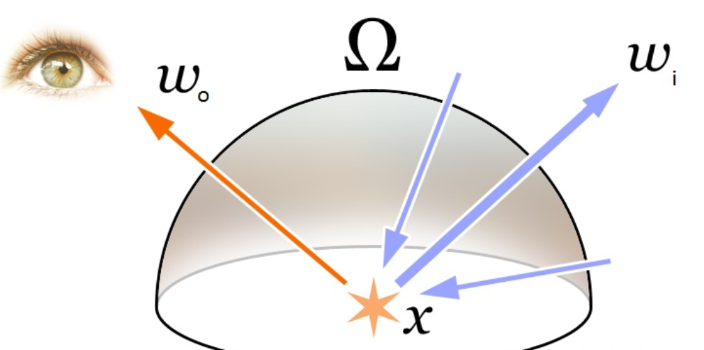

由于场景中物体无自发光，故$L_e$这项不存在，再将渲染方程中$f_r,G,V$三项由一个辐射度传输函数$T(x,w_0,w_i,x')$表示：
$$
L(x,w_0)=\int_S L(x',w_i)T(x,w_0,w_i,x')dw_i
$$
**这里的辐射度传输函数$T(x,w_0,w_i,x')$指的就是PRT中的Radiance Transfer，PRT技术即为对它进行预计算。**

对于只考虑1次弹射的间接光照：
$$
L_1(x,w_0)=\int_S f_r(x,w_i \rightarrow w_0)L_0(x',w_i)G(x,x')V(x,x')dw_i
$$
根据分解式$L(x,w_0)=L_0(x,w_0)+L_1(x,w_0)$，本项目的渲染方程可简写为：
$$
L(x,w_0)=L_0(x,w_0)+\int_S f_r(x,w_i \rightarrow w_0)L_0(x',w_i)G(x,x')V(x,x')dw_i
$$
对于间接光照的BRDF部分，我们只考虑漫反射部分，该部分为一个常量：
$$
f_r(x,w_i \rightarrow w_0)=\frac{c}{\pi}
$$
得到：
$$
L(x,w_0)=L_0(x,w_0)+\frac{c}{\pi}E_1(x)=L_0(x,w_0)+\frac{c}{\pi}\int_S L_0(x',w_i)G(x,x')V(x,x')dw_i
$$
最终全局光照中间接光计算的重点转换到对间接光漫反射辐照度irradiance的计算：
$$
E_1(x)=\int_S L_0(x',w_i)G(x,x')V(x,x')dw_i
$$
其中：

$c$表示物体本身的颜色albedo

$E_1(x)$表示当前着色位置$x$处经过1次弹射后的间接光漫反射辐照度irradiance

$L_0(x’,w_i)$表示从$x'$位置，朝方向$w_i$出射的直接光照的光线强度radiance

$G(x,x')$为$x$位置的法线向量与从$x'$入射到$x$的方向向量的内积$\vec N \cdot \vec L_i$

$V(x,x')$是可见性测试函数，表示$x$位置和$x'$位置之间是否可见

至此，PRT要做的是把上式中的$G(x,x')$和$V(x,x')$预计算出来，一种常用的方法是从$x$处向四周发射射线

要实现全局光照中物体之间光线的弹射效果，需要解决的关键问题有：

1. 需要对场景中所有可能的物体表面片段$x$都使用该渲染方程得到$w_0$方向的radience，但物体表面片段太多，这样做显然计算量过大不可行。

   对该问题的一种常用解决方案是在场景中摆满人为设定数量的采样点probe，对probe的周围所有方向做该渲染方程的计算，最后渲染物体表面片段时只需采样周围probe插值的近似结果即可。

2. 对所有采样点probe周围所有可能的$w_0$方向计算渲染方程。

   这是PRT技术主要解决的问题。假如场景和光源都是静态的，那么可以使用IBL(Image based lighting)技术先离线地在每个采样点渲染场景并将结果保存在立方体贴图中，如果有n个采样点就至少需要预渲染n次直接光照的场景以及保存n个立方体贴图，由于做一次这些操作的计算量很大，所以这种方法只能用于离线的预计算。静态光源场景的渲染方程中所有的$L(x',w_i)$和$T(x,w_0,w_i,x')$都是不变的，即所有的$L(x,w_0)$也不变，IBL技术将每个采样点周围环境整体视为一个静态大光源，直接将预计算好的$L(x,w_0)$静态结果保存在贴图中。而当场景中光源动态变化时，由于场景中的物体依然是静态的，渲染方程中$L(x',w_i)$是动态变化的而$T(x,w_0,w_i,x')$依然是不变的，本项目的方法是将静态的$T(x,w_0,w_i,x')$进行预计算保存而对动态变化的$L(x',w_i)$进行实时更新计算，能够达到实时全局光照的效果。

## 本项目的实现方案

参考GDC2016中“全境封锁”的全局光照技术，本项目使用opengl实现了一个简化版的动态全局光照demo以试验效果，以下是该demo的实现过程：

1. 在场景中均匀等间隔地摆放Probe，如下图：

   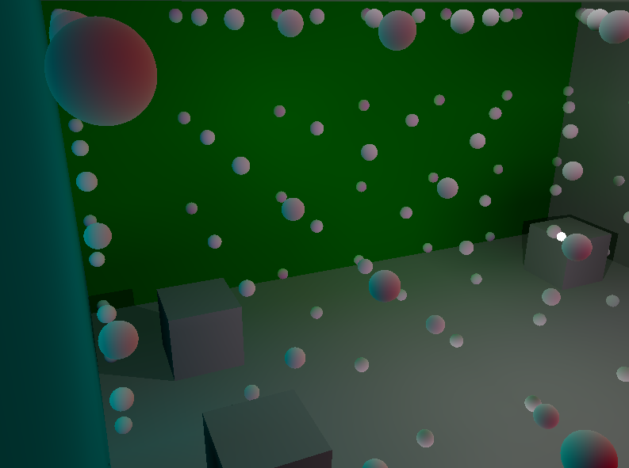

2. 每个Probe均匀地向四周发射射线，记录每条射线在场景中第一次碰撞到的表面信息surfel，包括位置、法线、颜色及其他材质信息，以及每条射线方向向量对应的球谐基函数的值

3. 对每条射线计算该射线方向的辐照度irradiance，计算方法是将每条射线得到的surfel颜色作为辐射度radiance，通过对该射线半球方向计算所有收集到的radiance在该射线方向上的蒙特卡洛积分得到irradiance

4. 球谐函数编码光照，利用蒙特卡洛积分对每个probe所有法线方向irradiance的分布编码为球谐系数

5. 将所有probe的球谐系数存入3D纹理，每个probe的球谐系数对应3D纹理中的一个像素，3D纹理的作用是计算场景中每个位置周围Probe球谐系数的插值

6. 将该3D纹理传入shader中，在pixel shader阶段计算间接光时根据该片段在场景中的位置从3D纹理中采出对应的值作为对周围probe计算插值后该位置的球谐系数，再通过获得的球谐系数解码出该片段间接光的irradiance，该片段最终颜色值=直接光照颜色值+间接光照的irradiance*albedo/PI（对间接光在物体表面的反射只考虑diffuse部分）

7. 每当场景中的光源动态变化时，由于场景中的物体不变，probe的位置及其发射的射线是不变的，surfel的位置、法线及其他材质信息也是不变的，因此无需重新计算这些信息，只需要每次根据光源的变化回到第3步实时计算surfel的光照颜色并实时更新3D纹理中的球谐系数

最终使用二阶球谐实现的效果如下：


## 实现效果对比

### 二阶球谐

仅开启直接光：

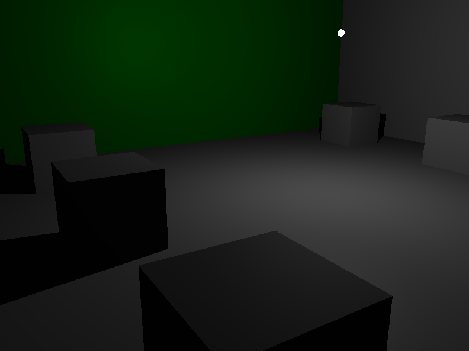

仅开启间接光：

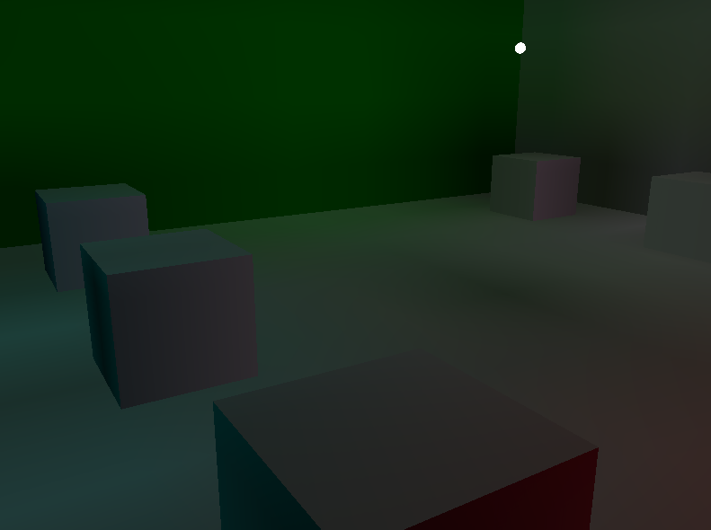


同时开启直接光和间接光：

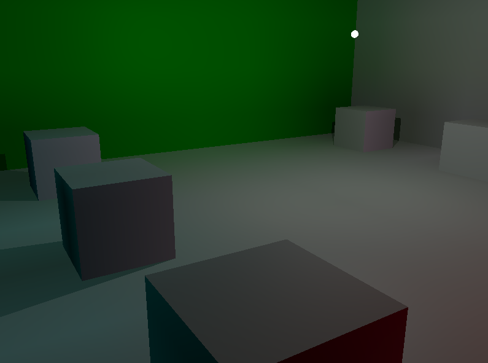


### 四阶球谐

仅开启直接光：


仅开启间接光：

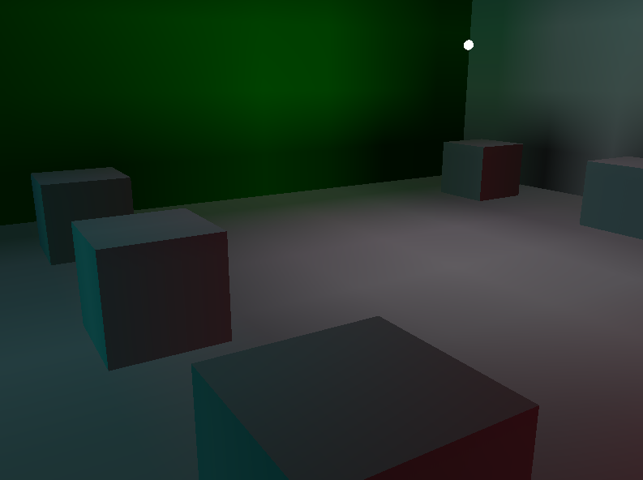


同时开启直接光和间接光：

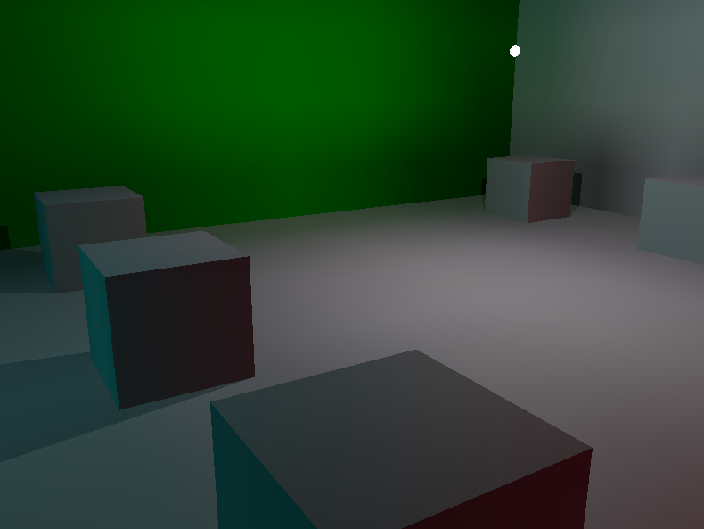


比较上面结果发现，二阶和四阶球谐均能得到明显的实时动态间接光效果，其中二阶球谐的效果更加柔和看起来更自然，而四阶球谐的间接光效果更加强烈，猜测原因是四阶球谐过于体现了场景中的物体表面法线单一的细节，而二阶球谐将简单场景模糊化了反而更加自然。

## 参考技术

### GDC2016中“全境封锁”的全局光照技术

​		由于以往的那些烘培光照贴图的全局光照技术并不适用于全动态的光照环境，该方案选择了相对更快速，计算成本更低，占用内存更少，并且适合在GPU上运行的预计算光能传递(Precomputed Radiance Transfer, PRT) Probe技术，把场景物体间复杂的光线交互进行预计算和综合。

​    	如下图所示，在场景中按照一定的规则摆放Probe（下图中的白色球体），每个Probe向四周均匀发出射线（下图中的绿线），并保存每条射线在场景中第一次碰到的几何体表面信息，记为surfel。为了降低计算花费，可以让这些Probe共享场景中的surfel位置。

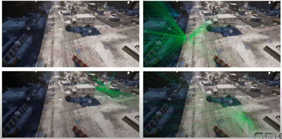

​		对于数据的存储计算，整个场景首先被划分为多个Sector Grid网格，接着这些网格继续划分为两个层级进行计算。如下图，第一个层级，对于每个surfel都有一个对应的Grid Cell记录下它的位置，法线，颜色等信息；第二个层级，将Grid中的所有surfel信息划分为多个brick，每个brick中有多个surfel，每个brick对它的多个surfel信息取平均，这样做减少了probe的计算量，每个probe的计算只需要用brick替代surfel进行。

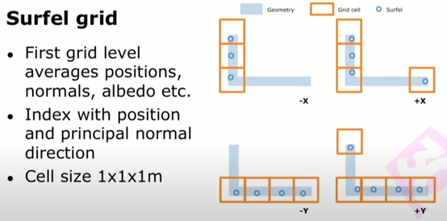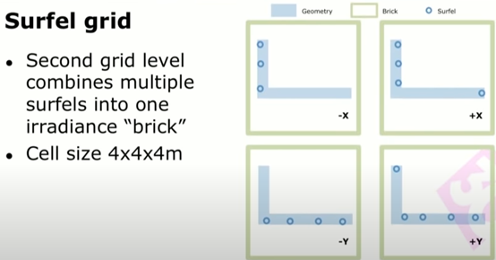

#### PRT实现方案

​		在使用Probe时，并不能使用Probe上特定法线方向收集到的radience来计算光能传递，而是要对每个方向结合整个Probe球体来计算。下图给出了三种计算光能传递的方案（PRT Transfer basis），左上的Probe是HDR Lightprobe（Grace Cathedral 格雷斯大教堂），每个法线方向收集到该方向的辐射度radience。

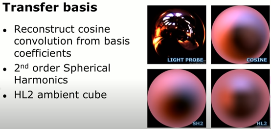

​		右上的Probe对原始Lightprobe中的每个法线对其对应的半球方向做余弦卷积（cosine convolution），得到每个法线方向的辐照度irradience。左下的Probe使用了二阶球谐光照（2nd Order Spherical Harmonics），是对右上Probe的近似表示，优点是只需要用若干个球谐系数就能近似表示Probe每个方向上的值，二阶球谐中每个颜色通道只需要保存4个浮点数即可。右下图是另一种近似表示的方法，使用”Advanced Real-Time Rendering in 3D Graphics and Games Course – SIGGRAPH 2006”中提到的HL2 ambient cube方法，它只需要在6个不同的法线方向计算其对应半球方向的余弦卷积cAmbientCube[0,1,2,3,4,5]，最后每个法线方向都能根据这6个方向的值得到该方向对应的值，计算过程如下：

```c++
float3 AmbientLight( const float3 worldNormal )
{
	float3 nSquared = worldNormal * worldNormal;
	int3 isNegative = ( worldNormal < 0.0 );
	float3 linearColor;
	linearColor = nSquared.x * cAmbientCube[isNegative.x] +
	nSquared.y * cAmbientCube[isNegative.y+2] +
	nSquared.z * cAmbientCube[isNegative.z+4];
	return linearColor;
}
```

​		下图表示了cAmbientCube的6个不同方向。

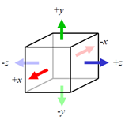

​		最后，对于每个物体表面间接光的计算，方法是采样该表面周围临近的probe，对这些probe做插值可近似得到该表面位置的辐照度。

## 本项目的实现细节及发现的问题

### 主要数据结构

Probe：probe所在的位置坐标position，向周围发射的一组射线rays，这些射线得到的一组surfels，这些surfel得到的一组irradiences

```c++
class Probe
{
public:
	glm::vec3 position;
	std::vector<Ray> rays;
	std::vector<Surfel> surfels;
	std::vector<glm::vec3> irradiances;
}
```

Ray：射线发射点的位置坐标position，射线的方向向量direction及其方向角度theta、phi，射线方向对应的一组球谐基函数值sh_functions(共有球谐阶数的平方个)

```c++
class Ray
{
public:
	glm::vec3 position; 
	glm::vec3 direction;float theta;float phi;
	std::vector<float> sh_functions;
}
```

Surfel：surfel的位置坐标position及其对应的probe的位置坐标probePosition，法线方向向量normal，材质信息surfel_material，辐射度颜色值color

```c++
class Surfel
{
public:
	glm::vec3 position;
	glm::vec3 probePosition;
	glm::vec3 normal;
	Material surfel_material;
	glm::vec3 color;
}
```

### 详细数据

场景大小：opengl中的20.0f\*20.0f\*10.0f，长宽均为20.0f，高为10.0f

场景描述：封闭式场景，场景边界都是可设定不同颜色的墙，地面上摆放了若干个大小为2.0f\*2.0f\*2.0f的白色立方体，场景中有一个可移动也可改变光照强弱的点光源

Probe数量：7*7*4=196个

每个Probe均匀向四周发射射线数量：100条

每个Probe对应的surfel数量：100个

场景中可能出现surfel的面积：20.0f\*20.0f\*2+20.0f\*10.0f\*4+2.0f\*2.0f\*6\*6=1744.0f

Surfel总数：本demo中每个Probe的每条射线对应一个surfel，共19600个。假如让所有probe共享surfel，场景中每1.0f单位面积使用一个surfel，则surfel总数可减少为1744个

场景面数：每个墙或立方体有12个面，给定6面墙和6个立方体，则共有12\*(6+6)=144个三角面

场景顶点数：面数\*3=432个顶点

场景中物体的法线：未使用法线贴图，每个面上所有点的法线相同，即垂直于该面

帧率：定为约30帧每秒

### 球谐函数

将球谐函数用于编码每个probe所有法线方向irradiance的分布函数，该分布函数的自变量为probe球面的任意法线方向向量，因变量为该法线方向的间接光irradience，目的是将irradiance的分布函数编码成若干浮点数后再近似地解码出来。

**编码过程**：
$$
C^m_l=\int_Sf(s)Y^m_l(s)ds \approx \frac{4\pi}{N}\sum^{N-1}_{j=0}f(s_i)Y_l^m(s_i)
$$
其中$f(s)$为probe所有法线方向irradiance的分布函数（对应渲染方程中的$L(x',w_i)$），$Y^m_l(s)$为球谐基函数，S为所有法线所在的球面，实现中采用蒙特卡洛积分近似计算，$N$为probe向四周发射射线的数量，$s_i$为第$i$条射线的方向向量。

**解码过程**：
$$
\hat f(s)=\sum^{n-1}_{l=0}\sum^{l}_{m=-l}C_l^mY_l^m(s)=\sum^{n^2}_{i=0}c_iy_i(s)
$$
其中$\hat f(s)$为对$f(s)$的近似还原，$n$为球谐阶数，$i$和$(l,m)$的对应关系是$i=l * (l + 1) + m$。

这种方法将每个probe所有法线方向的irradience编码为若干个浮点数传入shader，大大减少了计算的数据量，而且较少的球谐系数对于probe之间的插值计算也更加方便（对于二阶球谐，每个颜色通道只需要4个浮点数作为球谐系数，而这4个浮点数正好可以用3D纹理中的RGBA四个通道表示）。

球谐基函数表（前四阶的实数部分，$l<=3$，xyz为球面坐标，r为球的半径)：

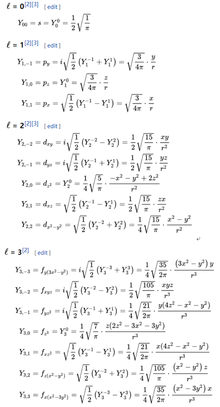

### 阴影

#### 直接光阴影

点光源的直接光阴影使用深度缓冲立方体贴图实现，可从贴图中采出点光源从任意方向出发的光线照射到物体片段的最近深度值，渲染场景时对每个片段判断其与光源的距离，如果距离比最近深度值大则该片段被遮蔽。

#### 阴影对间接光的影响

如果某些片段的直接光照被遮蔽，那么当probe向周围发射的射线击中该片段时，该片段surfel的颜色计算也应该考虑直接光照的遮蔽。由于在渲染场景时直接光阴影使用深度缓冲立方体贴图实现，所以surfel的直接光遮蔽要另外计算，本实现方案在CPU中计算surfel的颜色值，对每个surfel判断其与光源的连线是否有面的遮挡，如果有遮挡则取消其直接光照。更好的实现方案是将这些计算过程放在compute shader中加速。该效果的实现如下所示，可以看出如果考虑阴影对间接光的影响，被遮蔽周围地区有明显的变暗效果，遮蔽更加真实。

不考虑阴影对间接光的影响：

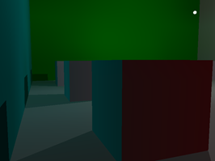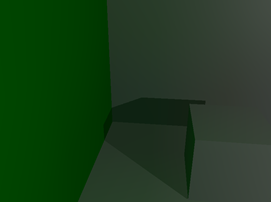

考虑阴影对间接光的影响：

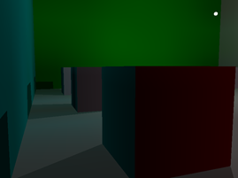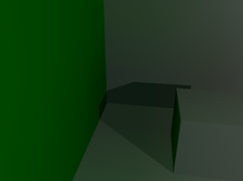

## 实现过程中遇到的问题及处理方法

### 3D纹理的边界问题

实现方案中probe的位置尽量均匀地铺满整个场景，每个probe对应3D纹理中的一个像素，这样在场景中的任意位置都能通过采样该3D纹理自动插值得到该位置上近似的probe。

由于probe只摆放于场景内部，在具体实现中会出现摆放的probe边界与场景实际边界不统一的问题，会出现奇怪的效果如下，绿色墙下的地面出现了红色，红色墙下的地面出现了绿色，分析后发现这是因为在出现这些奇怪效果的位置采样3D纹理时超出了纹理边界（纹理边界与probe摆放的边界近似相同），该问题的处理方法是设置3D纹理的GL_CLAMP_TO_EDGE参数，即如果超出3D纹理的边界则直接采用边界的效果。

处理前墙下地面的奇怪效果：

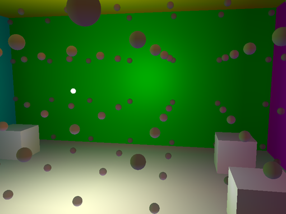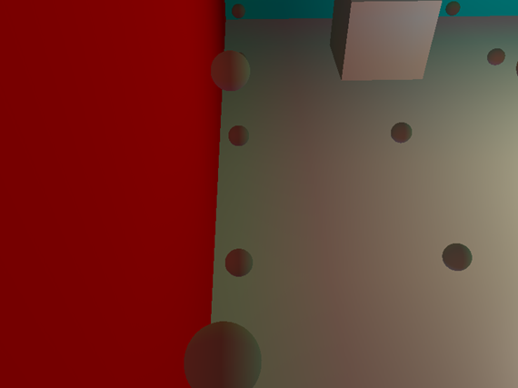

处理后墙下地面的效果较为自然：

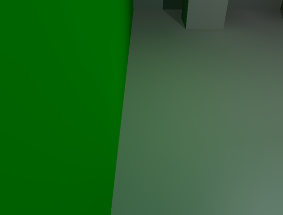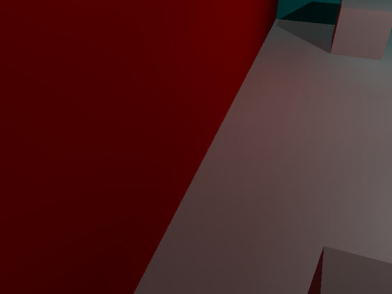

### 增加阴影后立方体物体内的probe产生的问题

给场景增加阴影前的立方体周围：

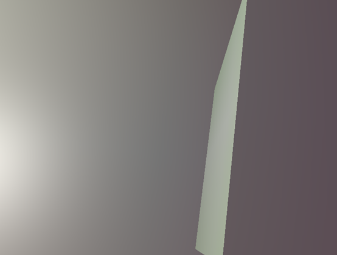

给场景增加阴影后，立方体周围出现奇怪的一圈颜色：

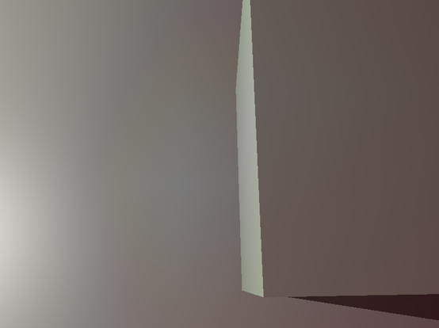

分析发现，立方体内部的probe被立方体的一个面的反面照亮，这是立方体物体内部的probe与外面的probe插值出的奇怪效果：

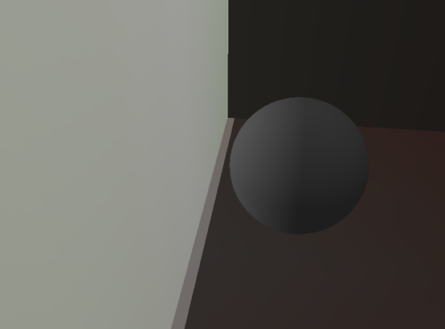

去除反面照亮后，立方体内部的probe全黑：

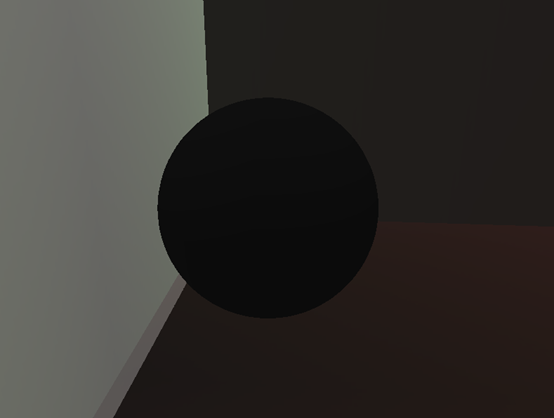

虽然立方体内部的probe全黑正常了，但立方体周围又出现奇怪的黑色，这仍然是插值出的奇怪效果，根本原因是立方体物体内外的probe差别太大：

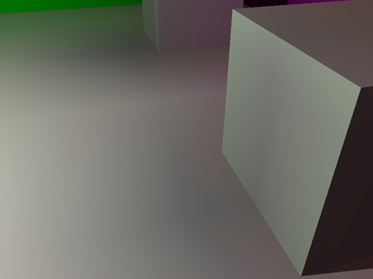

为了平衡立方体物体内外的probe，最后的处理方法是对每个在立方体物体内部的probe向周围发射的射线射出到probe所在的立方体物体外，得到的surfel都在立方体物体外，这样做相当于对物体内部的probe计算时忽略了该物体，处理后的probe如下：

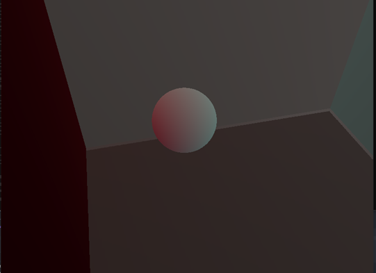

处理后物体内外的probe光照较为接近，消除了插值引起的明显奇怪效果：

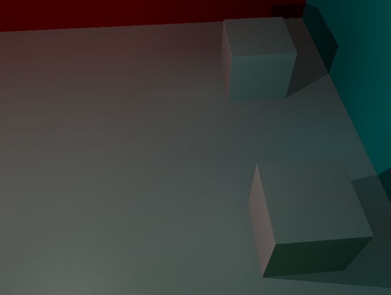

### Probe的球谐光照计算中存在的问题

实验发现，当场景中只有一面是绿色而其他面都是白色时，probe背向绿色的面会出现一些奇怪的紫红色：

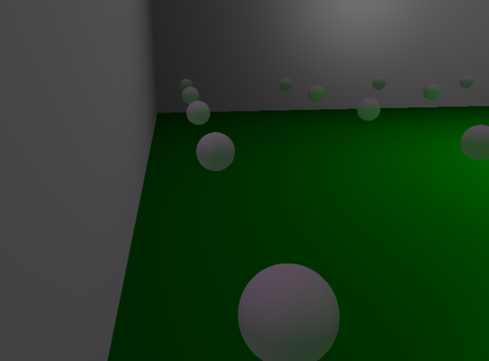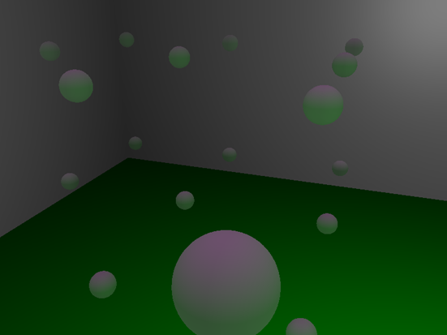

而如果将白色的面都改为黑色，或者将绿色的面改为黑色，都不会出现奇怪的颜色：

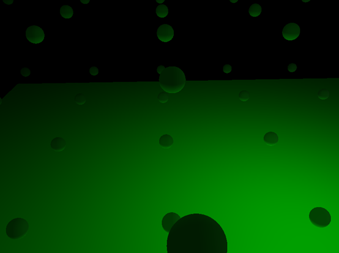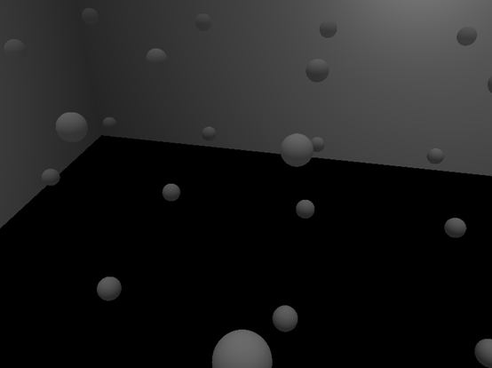

猜测这是球谐本身的近似计算引起的，probe在绿色地面方向的绿色成分相对较多而在其他白色墙方向的紫红色成分相对较多，将上面两张图的球谐效果叠加如下，未出现奇怪的颜色，说明这是球谐近似计算整体颜色分布存在的问题：

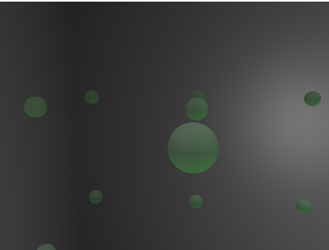
